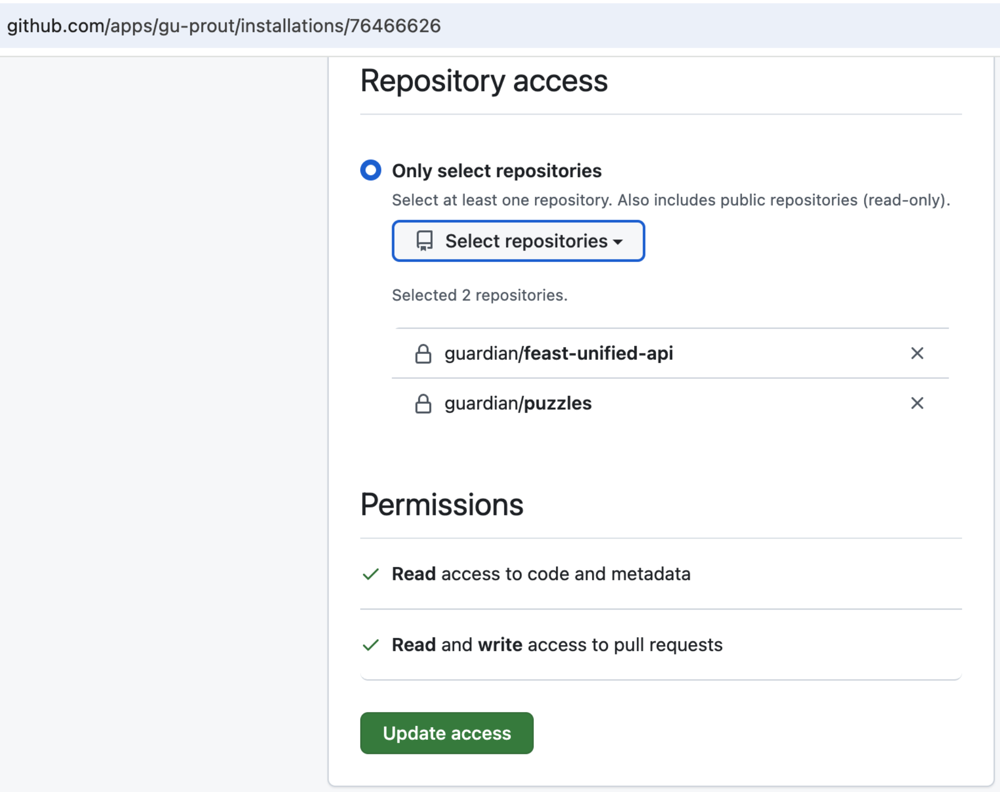

# Prout

_"Has your pull request been deployed yet?"_ - [Guardian blogpost](http://www.theguardian.com/info/developer-blog/2015/feb/03/prout-is-your-pull-request-out)

Tells you when your pull-requests are live. Tells you when they're not, and should be.


Prout comes from the tenet that:

    Developers are responsible for checking their changes on Production

This becomes more important, and _easier_ once you move to a Continuous Deployment
release process. Important, because now a developer can break the site simply by
hitting 'Merge' on a pull request - but also easier because with such a small delay
(say, [less than 10 minutes](https://github.com/guardian/membership-frontend/pull/14#issuecomment-68436665)) between merging the work and having it ready to view in a
Production setting, the developer is in a much better place to review their work;
it's still fresh in their mind.

While everyone on your team may agree with this philosophy, that 10 minute lag
between merge and deploy can be enough time for a developer like me to get distracted
("Look, shiny thing!" or, more realistically, "What's the next bit of work?") and
forget about promptly reviewing their changes on Production.

Prout simply notifies developers in their pull request that the code has been _seen_
in Production (a slightly stronger statement than simply saying it's been deployed).


# Configuration

Follow the 4-step program:

1. [Give Prout access](#give-prout-access) to your repo (so it can set labels on your pull request)
2. [Add one or more `.prout.json` config files to your project](#add-config-file)
3. [Add callbacks to prout](#add-callbacks) - ie a GitHub webhook and ideally also a post-deploy hook
4. [Expose the commit id](#expose-the-commit-id) of your build on your deployed site

## Give Prout access

Prout authenticates as a [GitHub App](https://docs.github.com/en/apps/creating-github-apps/about-creating-github-apps/about-creating-github-apps)
in order to:

* Update PRs with comments and labels
* Receive webhook calls from GitHub to let Prout know that PR states have changed

**Guardian developers:** Our GitHub App for Prout is [gu-prout](https://github.com/apps/gu-prout) - click
`Configure` to grant access to your specific repo:



Since [August 2025](https://github.com/guardian/prout/pull/141),
Prout no longer uses a [GitHub **user**](https://docs.github.com/en/get-started/learning-about-github/types-of-github-accounts#user-accounts)
account - you should remove any access granted to the old [@prout-bot](https://github.com/prout-bot)
user account.

## Add config file

Add a `.prout.json` file to any folder you want monitored in your repo:

```
{
  "checkpoints": {
    "DEV": { "url": "http://dev.mysite.com/", "overdue": "10M" },
    "PROD": { "url": "http://mysite.com/", "overdue": "1H" }
  }
}
```

When a pull-request changes a file anywhere under that folder, Prout will scan the
checkpoints defined in your config file, and update the pull-request with labels
and a comment as appropriate. The url you specify in the checkpoint will be fetched,
and the contents of the response will be read- so long as you embed the commit id
that response, Prout will be able to work out whether or not the PR has been deployed.

## Add callbacks

Add Prout-hitting callbacks to GitHub and (optionally) post-deploy hooks to your deployment systems
so that Prout can immediately check your site.

### Post-deploy hooks

If desired, you can configure your deploy system to use a post-deploy webhook to notify Prout that deployment
has finished.

This is not _required_ (as Prout will be polling to the checkpoint url _anyway_) but may mean that
Prout can be a _little_ quicker to report that a PR has been deployed.

Whatever deployment tool you use (RiffRaff, Heroku, etc), you can set it to hit Prout
as a post-deploy hook (for your repo on _github.com/[owner]/[repo]_):

```
https://prout-bot.herokuapp.com/api/update/[owner]/[repo]
```

Hitting that url (`GET` or `POST`) will always prompt Prout to
scan the repository for outstanding pull-requests.

## Expose the commit id

You must embed the commit id in your site - we do this on
[membership.theguardian.com](https://membership.theguardian.com/)
for instance.

Prout [searches the response body and headers](app/lib/CheckpointSnapshot.scala#L45-L58) for any 40-character string of hexadecimal digits surrounded by word breaks, so adding the commit id almost anywhere should work. 

I use the [`sbt-buildinfo`](https://github.com/sbt/sbt-buildinfo) plugin to store the Git commit id in my stored artifact, and then expose
that value on the production site. The ugly-looking SBT config is:

```
buildInfoKeys := Seq[BuildInfoKey](
      name,
        "gitCommitId" -> (Option(System.getenv("GITHUB_SHA")) getOrElse (try {
        "git rev-parse HEAD".!!.trim
      } catch {
          case e: Exception => "unknown"
      }))
    )
```

## Slack

Users [can configure a Slack hook](https://github.com/guardian/prout/pull/11) for Prout
by creating a new Slack 'Incoming Webhook':

https://your-domain.slack.com/services/new/incoming-webhook

...this will get you a 'Webhook URL', which looks something like this:

https://hooks.slack.com/services/T05FTQF9H/B012N1Y2Y/p9VyRC1ZlTqNGuu

...stick that url into a GitHub webhook for your repo as the 'Payload URL':

https://github.com/my-org/my-repo/settings/hooks/new

...and then (optionally) **disable** the hook in GitHub! You don't actually want to send _GitHub_
events to the hook - this is just a place to store the private url where Prout can find it.
**Note that Prout needs repo-admin access in order to read the hook data!**

# Status

Prout has a status page per repository available at
https://prout-bot.herokuapp.com/view/{organisation}/{repository}. This lists useful information
like if it was able to find `.prout.json`, which commit it thinks is currently deployed in
production, etc.

Prout also logs lots of useful information which is available in the heroku backend.


# Run your own instance of Prout

[](https://heroku.com/deploy?template=https://github.com/guardian/prout)

...you want to run your own instance of Prout - the instance at https://prout-bot.herokuapp.com/
is really only for the Guardian.

